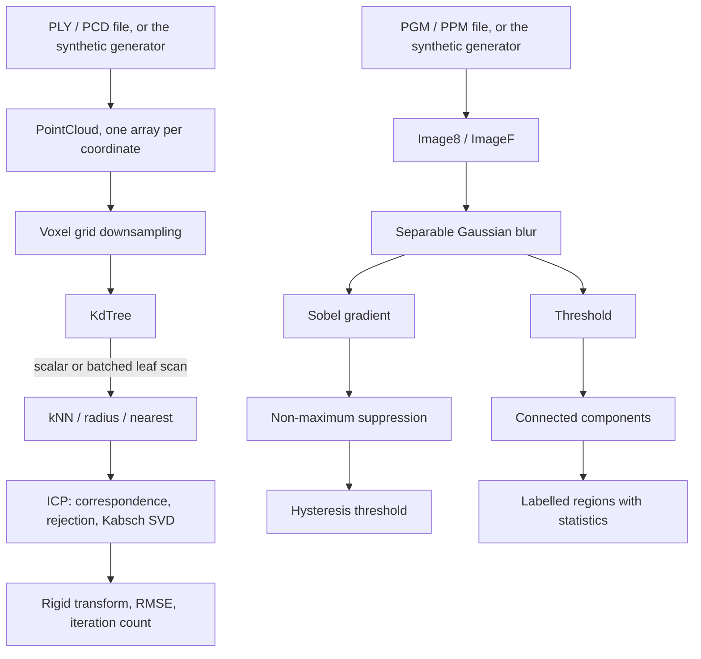

# PointForge

A C++20 point cloud and depth image processing pipeline. Course project for Computer Vision.

## What it is

PointForge takes point clouds and grayscale images and turns them into something a program can
reason about: downsampled geometry, neighbourhood queries, two overlapping scans brought into one
coordinate frame, edges, and labelled regions. Every geometric stage leans on the same primitive,
finding the points near a given point, so that primitive is built once as a separate component over
a k-d tree, with two interchangeable inner loops so the cost of each can be measured against the
other. The pipeline is arranged so each stage can be timed and checked on its own.

## No dependencies

The build needs a C++20 compiler and CMake 3.20 or newer. Nothing else. There is no package
manager, no network fetch at configure time, and no optional feature that quietly turns itself off.

That constraint shapes three things in the source tree:

- The test runner is 118 lines in `tests/test_framework.hpp` plus a `main`, registered with CTest.
- The timing harness is `std::chrono::steady_clock` in `include/pointforge/timing.hpp`.
- The 3x3 singular value decomposition that ICP needs is a one-sided Jacobi in `src/transform.cpp`.

## What is implemented

| Area | What it does | Where |
| --- | --- | --- |
| Point cloud storage | One contiguous array per coordinate, not an array of triples | `include/pointforge/point_cloud.hpp` |
| Cloud I/O | ASCII PLY and ASCII PCD, read and write, columns matched by name | `src/cloud_io.cpp` |
| Voxel grid downsampling | Configurable leaf size, centroid per cell, repeatable output order | `src/voxel_grid.cpp` |
| k-d tree | Median split on the widest axis, kNN, radius search, single nearest | `src/kdtree.cpp` |
| Two query paths | Scalar and batched leaf scan behind one method, selected by argument | `src/kdtree.cpp` |
| ICP registration | Nearest-neighbour correspondence, distance rejection, Kabsch/SVD, RMSE reporting | `src/icp.cpp` |
| Image I/O | Binary PGM (P5) and PPM (P6), header comments handled | `src/image_io.cpp` |
| Edge detection | Separable Gaussian, Sobel, non-maximum suppression, hysteresis threshold | `src/image_ops.cpp` |
| Segmentation | Connected components, 4 or 8 connectivity, per-component statistics | `src/labeling.cpp` |
| Synthetic data | Clouds and images from a seed, so the demo needs no external dataset | `src/synthetic.cpp` |

Recognition, classification and neural networks are deliberately out of scope. They need a labelled
dataset and a different evaluation method, and the report says so rather than leaving a gap.
OpenCV and PCL are not used, not even optionally, because a comparison against a library the
project does not otherwise need would have added a dependency to the build for one table.

## Architecture

Four layers. Data representation at the bottom, the spatial index above it, the processing stages
above that, applications on top. Stages depend only on the two lower layers, never on each other.



## Build

Verified on Windows 11 with g++ 15.2.0 (MinGW-w64), CMake 4.3.2 and Ninja 1.13.2.

```bash
cmake -S . -B build -G Ninja -DCMAKE_BUILD_TYPE=Release
cmake --build build
```

Ninja is a convenience, not a requirement. Drop `-G Ninja` to use the default generator.

## Run the tests

```bash
ctest --test-dir build --output-on-failure
```

Six CTest entries, one per test source file, covering 60 test cases. The test binary can also be
run directly, with an optional suite name:

```bash
./build/pointforge_tests            # all suites
./build/pointforge_tests kdtree     # one suite
```

## Run the demo

```bash
cmake --build build --target demo
```

That builds and runs `pointforge_demo`, which generates two clouds with a known rigid transform
between them, registers them, and prints the recovered transform next to the ground truth along
with the final RMSE and the iteration count. It then runs edge detection and segmentation on a
generated image. Outputs land in `build/demo-output/`: three PLY files and seven PGM/PPM files.

To choose the output directory, run the binary directly:

```bash
./build/pointforge_demo --output-dir some/where
```

## Run the measurements

```bash
cmake --build build --target bench
```

Or directly, which also lets you name the CSV:

```bash
./build/pointforge_bench --csv results/measurements_baseline.csv
```

The harness reports the minimum of the repetitions as the headline figure, with the median and the
spread beside it. On a machine with background load the median moves and the minimum does not, and
the spread column is what tells you which case you are in. The recorded runs are in `results/`.

To measure with the full instruction set of the build machine:

```bash
cmake -S . -B build-native -G Ninja -DCMAKE_BUILD_TYPE=Release -DPOINTFORGE_NATIVE_ARCH=ON
cmake --build build-native
./build-native/pointforge_bench --csv results/measurements_native.csv
```

That binary is not portable to a different machine, which is why the option is off by default.

## Documentation

The project report lives in `docs/`. It is written in Bulgarian, because the subject is taught in
Bulgarian and the layout rules are normative for the TU-Sofia Faculty of Computer Systems and
Technologies. Build it with:

```bash
cd docs && latexmk -pdf Main.tex
```

Output lands in `docs/build/Main.pdf`, which is committed so the report can be read without a LaTeX
toolchain. Unfilled facts are marked with `\TODO{...}` and are found with
`grep -rn 'TODO' docs/chapters docs/Main.tex`.

## Status

- [x] Repository scaffold
- [x] Report skeleton, title page and chapter structure
- [x] Bibliography
- [x] CMake build, no third-party dependencies
- [x] Point cloud and image data types
- [x] ASCII PLY and PCD reader and writer
- [x] Binary PGM and PPM reader and writer
- [x] Voxel grid downsampling
- [x] k-d tree with kNN, radius search and single nearest
- [x] Scalar and batched leaf scan, both measured
- [x] Point-to-point ICP with SVD-based transform estimation
- [x] Gaussian blur, Sobel, non-maximum suppression, hysteresis
- [x] Connected component labelling
- [x] Synthetic cloud and image generator
- [x] Test suite, 60 cases under CTest
- [x] Measurement harness with CSV output
- [x] Demo
- [x] Measurements recorded and written into the report

## License

MIT. See [LICENSE](LICENSE).
