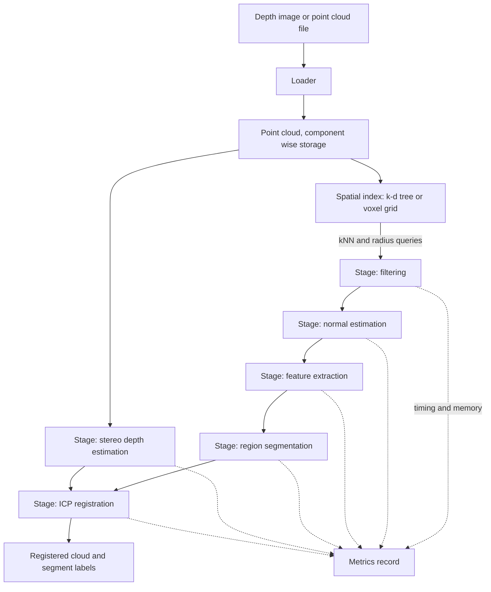

# PointForge

A C++20 point cloud and depth image processing pipeline. Course project for Computer Vision.

## What it is

PointForge takes the output of a depth sensor or a stereo camera and turns it into something a
program can reason about: filtered geometry, per point features, homogeneous regions, and a set of
overlapping scans brought into one coordinate frame. Every stage in the chain leans on the same
primitive, finding the points near a given point, so that primitive is built once as a separate,
SIMD accelerated component over a spatial index. The pipeline is arranged so each stage can be timed
and checked on its own, rather than only end to end.

## Goals

- Implement the pipeline stages in this repository: filtering, normal estimation, feature
  extraction, region segmentation, stereo depth estimation, and ICP registration.
- Provide two interchangeable spatial index implementations, a k-d tree and a voxel grid, behind one
  narrow query interface.
- Accelerate the nearest neighbour query with explicit SIMD over component wise point storage.
- Make every stage separately measurable: each returns its own timing and memory record.
- Verify each stage against a reference implementation for agreement before comparing speed.
- Keep neural network based recognition out of scope, and say why in the report.

## Technologies

| Technology | Version or standard | Why |
| --- | --- | --- |
| C++ | C++20 | Concepts and ranges keep the stage interface narrow without runtime cost. |
| CMake | 3.20 or newer | Presets and target level options, needed to compile the SIMD files separately. |
| xsimd | latest release | Portable vectorisation in one source tree, with `std::simd` as the later replacement. |
| OpenCV | 4.x | Image and depth map I/O, plus a reference implementation to compare against. |
| PCL | 1.13 or newer | Point cloud I/O, plus a reference implementation to compare against. |
| GoogleTest | 1.14 or newer | Unit tests, including the exhaustive search oracle for index queries. |
| Google Benchmark | 1.8 or newer | Repeated timing with median and spread, not a single stopwatch reading. |

Reference libraries are used for I/O and comparison only. The algorithms under study are implemented
here, otherwise the measurement would compare a library against itself.

## Architecture

Four layers. Data representation at the bottom, the spatial index above it, the processing stages
above that, and the pipeline on top. Stages depend only on the two lower layers and never on each
other, so a stage can be rerun with different parameters without rerunning the ones before it.
Points are stored as one contiguous array per coordinate, which is what makes the vectorised query
worthwhile.



## Build

```bash
cmake -S . -B build -DCMAKE_BUILD_TYPE=Release
cmake --build build -j

# tests
ctest --test-dir build --output-on-failure

# benchmarks
./build/benchmarks/pointforge_bench
```

## Documentation

The project report lives in `docs/`. It is written in Bulgarian, because the subject is taught in
Bulgarian and the layout rules are normative for the TU-Sofia Faculty of Computer Systems and
Technologies. Build it with:

```bash
cd docs && latexmk -pdf Main.tex
```

Output lands in `docs/build/Main.pdf`. Unfilled facts are marked with `\TODO{...}` and are found
with `grep -rn 'TODO' docs/chapters docs/Main.tex`.

## Status

- [x] Repository scaffold
- [x] Report skeleton, title page and chapter structure
- [x] Bibliography
- [ ] CMake build
- [ ] Point cloud and depth image data types
- [ ] k-d tree index
- [ ] Voxel grid index
- [ ] SIMD accelerated kNN and radius queries
- [ ] Filtering stage
- [ ] Normal estimation stage
- [ ] Feature extraction stage
- [ ] Region segmentation stage
- [ ] Stereo depth estimation stage
- [ ] ICP registration stage
- [ ] Pipeline driver and configuration
- [ ] Test suite
- [ ] Benchmark harness
- [ ] Measurements and results chapter

Nothing is implemented yet. This pass is the repository, the README and the report skeleton only.

## License

MIT. See [LICENSE](LICENSE).
